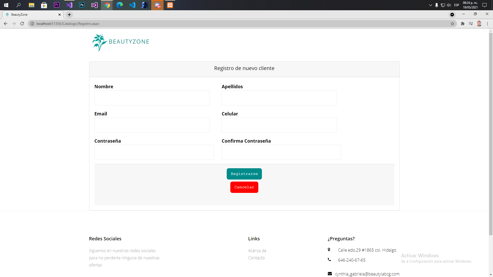
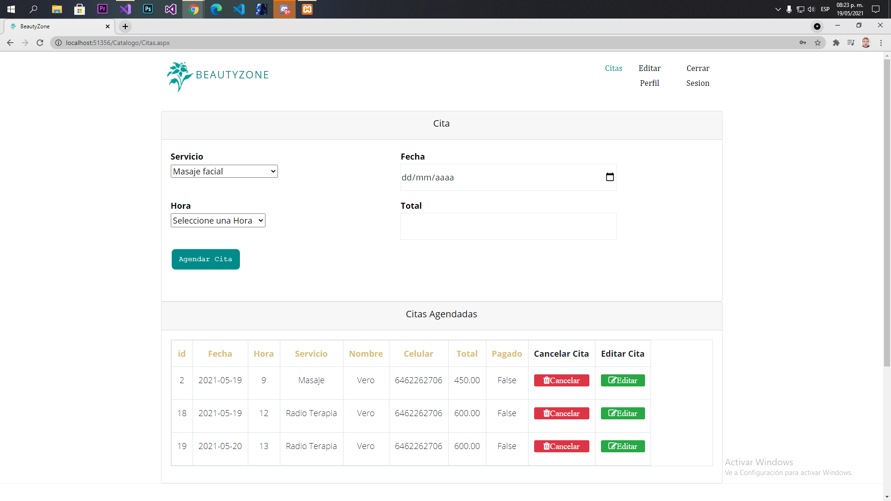
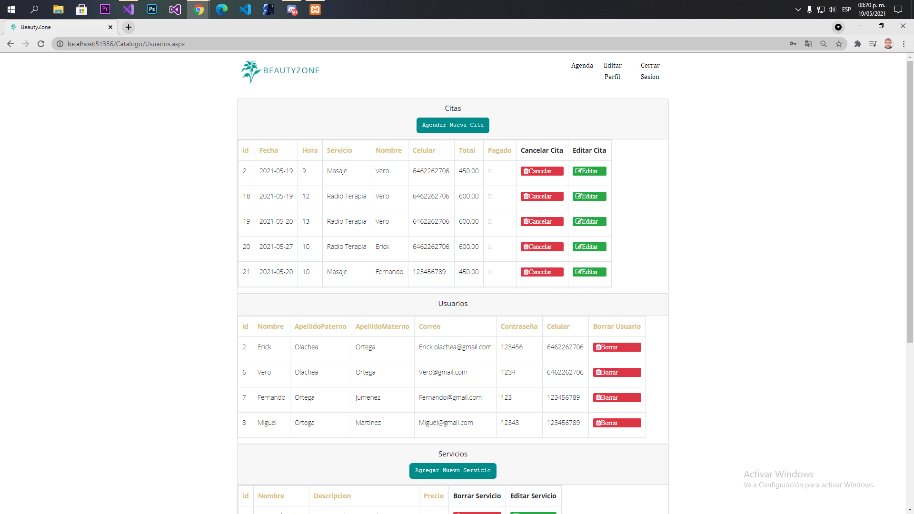
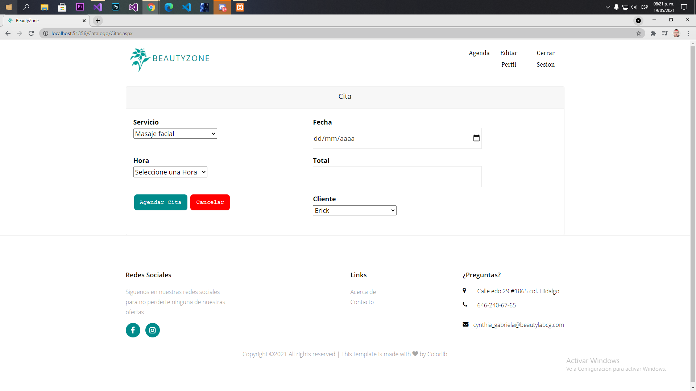
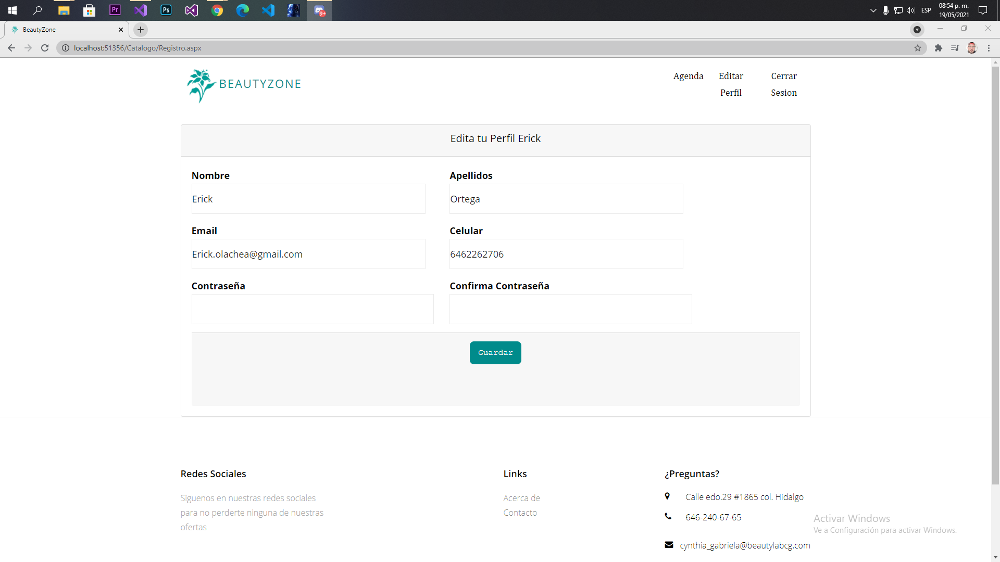

# SistemaCitas
En este sistema de citas, los clientes
puedan ver en cualquier momento los horarios disponibles, así como
también los servicios que se ofrecen en el establecimiento. De este modo, se
generará una comodidad para ambas partes en el uso y manejo del tiempo
de cada uno, tanto el lado del cliente como de la persona que atiende.
Este sistema se utilizo C#, asp.net y una base de datos de mysql, es sistema intuitivo
al momento de querer agendar citas o querer modificarlas, por lo que no
debería generar ningún problema el uso de este medio para los usuarios.
Este sistema de citas fue pensado para implementarse en un spa.

## Video: Explicacion del sistema

## Imágenes del sistema
### Es el login del sistema

### Este es el apartado del registro de los clientes

### Apartado del clinte para agendar citas

### Apartado del administrador

### Apartado del administrador para agendar o editar citas

### Apartado del administrador para crear o editar servicios

### Apartado para editar datos personales

